# System Architecture

## Flow Diagram

```mermaid
graph LR
    User["👤 User Query<br/><i>Example: 'How does<br/>authentication work<br/>in signify?'</i>"]
    
    User --> Orchestrator["🤖 Orchestrator Agent<br/>(ReACT Pattern)"]
    
    Orchestrator -->|calls| T1["📋 list_available_repositories<br/><i>Lists all repos</i>"]
    Orchestrator -->|calls| T2["📄 get_repo_documentation<br/><i>Returns README + tree</i>"]
    Orchestrator -->|calls| T3["🔍 search_keyword<br/><i>Fast keyword search</i>"]
    Orchestrator -->|calls| T4["📖 read_code<br/><i>Read file with lines</i>"]
    Orchestrator -->|calls| SemanticSearch["🧠 Semantic File Search Tool"]
    
    T1 -->|returns| Orchestrator
    T2 -->|returns| Orchestrator
    T3 -->|returns| Orchestrator
    T4 -->|returns| Orchestrator
    SemanticSearch -->|returns| Orchestrator
    
    Orchestrator -->|final| Response["✨ Final Answer<br/><i>Wrapped in<br/>&lt;answer&gt; tags</i>"]
    
    Response --> User
    
    SemanticSearch -.->|detailed flow| SS_Subgraph
    
    subgraph SS_Subgraph["Semantic File Search - Internal Flow"]
        direction TB
        
        SS_Input["Query Input"]
        
        SS_Input --> SS_Step1["1️⃣ HyDE Generator<br/><i>Creates hypothetical<br/>code answer</i>"]
        
        SS_Step1 --> SS_Step2["2️⃣ Keyword Extractor<br/><i>Extracts technical<br/>keywords from HyDE</i>"]
        
        SS_Step2 --> SS_Step3["3️⃣ Keyword Search<br/><i>Finds files with<br/>keywords, sorted<br/>by occurrence</i>"]
        
        SS_Step3 --> SS_Decision{"Many<br/>files?"}
        
        SS_Decision -->|Few| SS_Return1["Return file paths"]
        
        SS_Decision -->|Many| SS_Step4["4️⃣ Chunking<br/><i>Split files into<br/>token-based chunks</i>"]
        
        SS_Step4 --> SS_Step5["5️⃣ Embedding<br/><i>Embed HyDE answer<br/>+ all chunks<br/>using Ada-2</i>"]
        
        SS_Step5 --> SS_Step6["6️⃣ Similarity Ranking<br/><i>Cosine similarity<br/>between HyDE & chunks</i>"]
        
        SS_Step6 --> SS_Return2["Return top files<br/>with line numbers"]
        
        SS_Return1 --> SS_Output["Output"]
        SS_Return2 --> SS_Output
    end
    
    style User fill:#e1f5ff
    style Orchestrator fill:#fff4e1
    style SS_Subgraph fill:#f0f0f0
    style Response fill:#e8f5e9
    style SS_Step5 fill:#ffe1e1
```



## Key Components

### Orchestrator Agent
- Uses **ReACT pattern** (Thought → Action → Observation)
- Powered by **Azure OpenAI GPT-4**
- Supports **multi-turn tool calling** (up to 10 iterations)
- Wraps final answer in `<answer>` tags

### Tools

#### 1. `list_available_repositories`
- **Purpose:** List all available code repositories
- **Execution Time:** <0.01s
- **Output:** List of repository names

#### 2. `get_repo_documentation`
- **Purpose:** Fetch repository documentation and directory tree
- **Execution Time:** 0.01-0.10s
- **Priority Order:** `llms.txt` → `README.md` → Directory tree only
- **Output:** Documentation + full directory structure

#### 3. `search_keyword`
- **Purpose:** Fast keyword-based file search
- **Execution Time:** 0.10-0.50s
- **Features:**
  - Case-insensitive search
  - Counts keyword occurrences per file
  - Returns files sorted by occurrence count
  - Limits to top 50 files
- **Output:** List of file paths with occurrence counts

#### 4. `semantic_file_search`
- **Purpose:** Intelligent semantic search using HyDE and embeddings
- **Execution Time:** 5-15s (due to embeddings)
- **Flow:**
  1. **HyDE Generation:** Creates hypothetical code answer (500 words)
  2. **Keyword Extraction:** Extracts 8 short technical keywords (3-8 chars)
  3. **Keyword Search:** Finds candidate files using keywords
  4. **Chunking:** Splits files into 500-token chunks with 100-token overlap
  5. **Embedding:** Uses Azure OpenAI Ada-2 embedder
  6. **Ranking:** Cosine similarity between HyDE and chunks
  7. **Return:** Top 10 files with line numbers
- **Output:** Ranked file paths with specific line ranges

#### 5. `read_code`
- **Purpose:** Read specific file content with line numbers
- **Execution Time:** 0.01-0.10s
- **Features:**
  - Optional line range (start_line, end_line)
  - Automatic truncation at 200 lines
  - Shows line numbers in output
- **Output:** File content with line numbers

### Semantic File Search - Detailed Flow

The semantic search tool is the most sophisticated component:

```
User Query: "How does authentication work?"
    ↓
HyDE: Generates hypothetical implementation:
    """
    class AuthService:
        def authenticate(user, password):
            # Verify credentials
            token = jwt.encode(user.id)
            return token
    """
    ↓
Keywords: ["auth", "jwt", "token", "verify", "user", "login", "session", "encrypt"]
    ↓
Keyword Search: Finds 48 files containing these keywords
    - auth_service.py (125 occurrences) ← highest
    - jwt_handler.py (87 occurrences)
    - ...
    ↓
Chunking: Splits top 50 files into 500-token chunks
    → 145 chunks total
    ↓
Embedding: Ada-2 embeds HyDE + all chunks
    → 1 HyDE vector + 145 chunk vectors
    ↓
Similarity: Cosine similarity ranking
    1. auth_service.py (lines 45-120) - similarity: 0.89
    2. jwt_handler.py (lines 1-78) - similarity: 0.85
    ...
    ↓
Return: Top 10 files with line numbers
```

### Configuration

All parameters are centralized in `code_assistant/config.py`:

```python
SEMANTIC_SEARCH_CONFIG = {
    "chunk_size": 500,
    "chunk_overlap": 100,
    "max_files_to_search": 50,
    "top_k_results": 5,
    "max_results_with_lines": 10,
    "num_keywords": 8,
    "max_keyword_retries": 3
}

CODE_READING_CONFIG = {
    "max_lines": 200
}
```

## Technology Stack

- **LLM Framework:** LangChain
- **LLM Provider:** Azure OpenAI (GPT-4o)
- **Embeddings:** Azure OpenAI Ada-2
- **Authentication:** Azure AD (EnvironmentCredential)
- **UI:** Streamlit
- **Tokenization:** tiktoken
- **Vector Operations:** NumPy (cosine similarity)

## Performance Characteristics

| Tool | Avg Time | Use Case |
|------|----------|----------|
| `list_available_repositories` | <0.01s | Quick repo discovery |
| `get_repo_documentation` | 0.05s | Initial context gathering |
| `search_keyword` | 0.30s | Fast file finding |
| `semantic_file_search` | 8-12s | Precise code location |
| `read_code` | 0.05s | Code examination |

**Total Query Time:** Typically 10-20s for complex queries with semantic search
